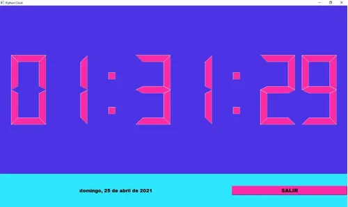

# Python-Clock-with-GUI
## Python Clock with beautiful GUI

>En este proyecto se desarrolla un reloj con Python el cual obtiene la hora desde el ordenador y la muestra en un display dentro de la interfaz grafica desarrollada con **PyQT5** por lo que es necesaria su instalación para el funcionamiento del codigo.
Se puede usar la **instalacion clasica** de la libreria desde la linea de comandos con PIP:

> - pip install PyQt5
> - ver el link https://pypi.org/project/PyQt5/ para mas informacion de la libreria 

>Del mismo modo es necesaria la instalación de PySide2 para algunas funciones dentro del codigo, podemos usar la siguiente linea para su instalacion:
> - pip install PySide2
> - ver el link https://pypi.org/project/PySide2/ para mas informacion de la libreria

>Ahora bien por ultimo, la interfaz fue desarrollada en QtDesigner, por lo que si se quiere ver o editar algun elemento de la misma es necesario realizar su instalacion y cargar dentro de esta el archivo **untitled.ui**.
> - Para la instalacion de QtDesigner podemos ir a la web oficial https://build-system.fman.io/qt-designer-download donde encontraremos el instalador tanto para Windows como para Mac. 

>Por ultimo, para ejecutar el codigo desde la linea de comandos nos ubicamos en el directiorio donde se encuentre el codigo y el archivo de interfaz **untitled.ui** y usamos la siguiente linea: 
> - python main.py 

>Con esto el codigo correra y podremos observar la siguiente interfaz con el reloj corriendo en tiempo real:
> - 
> - Se puede observar que tambien se agregó la fecha actual en la parte inferior de la interfaz.

